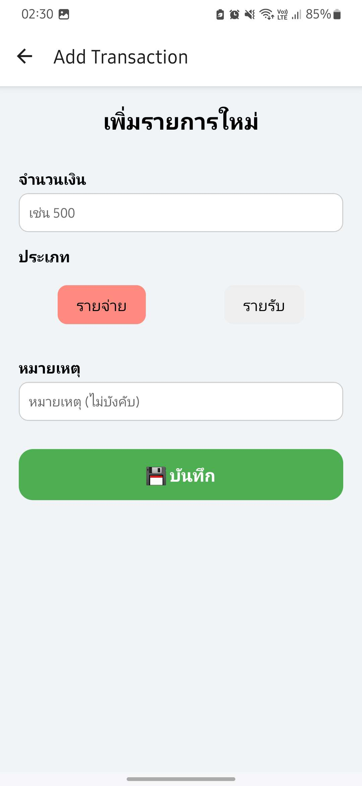
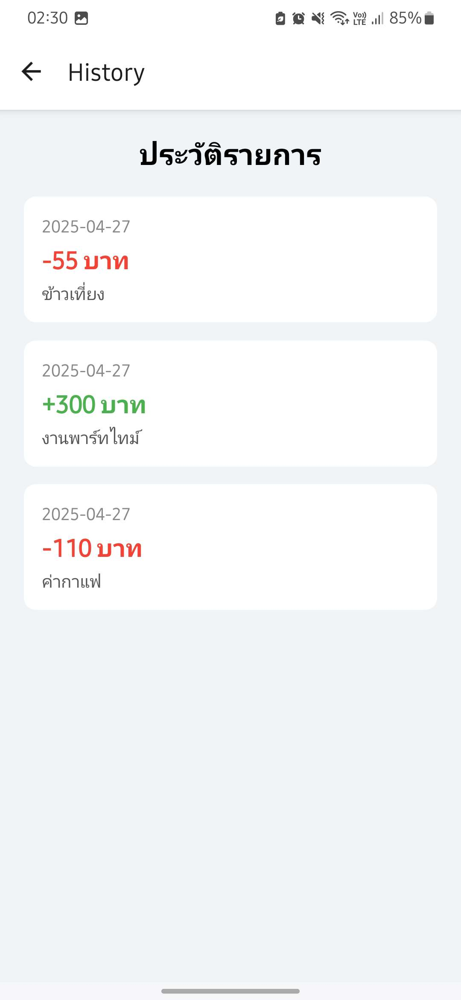

**ชื่อ - นามสกุล (Full Name):**  Thanaruk Kammarat

**รหัสนักศึกษา (Student ID):**  6631503021

**ชื่อแอป (App Name):**  FinLog

**Framework ที่ใช้ (Framework Used):** React Native

**ลิงก์ GitHub Repository:** https://github.com/ThanarukTK/FinLog.git

**ลิงก์ไฟล์ติดตั้ง (APK/IPA):** [ใส่ลิงก์ที่นี่ | Insert link here]

---

## 1. การออกแบบแอป | App Concept and Design (2 คะแนน / 2 pts)

### 1.1 ผู้ใช้งานเป้าหมาย | User Personas  
```markdown
Persona 1:  
- ชื่อ: ต้น
- อายุ: 20 ปี  
- อาชีพ: นักศึกษาปี 2  
- ความต้องการ: ต้องการจัดการรายรัยรายจ่ายใจแต่ละวัน

Persona 2:  
- ชื่อ: ตาล  
- อายุ: 22 ปี  
- อาชีพ: นักศึกษาฝึกงาน  
- ความต้องการ: ต้องการจัดการรายรับรายจ่ายในระหว่างฝึกงาน
```

### 1.2 เป้าหมายของแอป | App Goals  
**ตัวอย่าง (Example):**
```markdown
- ช่วยให้เห็นภาพเงินเข้าออก
- ช่วยควบคุมการใช้เงิน
- ช่วยตั้งเป้าหมายเก็บเงิน
```

### 1.3 โครงร่างหน้าจอ / Mockup  
**ใส่รูปภาพ หรือคำอธิบายแต่ละหน้าหลัก 3 หน้า | Attach image or describe 3 main pages**
```markdown



```

### 1.4 การไหลของผู้ใช้งาน | User Flow  
**ตัวอย่าง (Example):**
```markdown
เปิดแอป > เข้าหน้าหลัก > เลือก "เพิ่มรายการ" > ใส่จำนวนเงิน > เลือกประเภท > ใส่หมายเหตุ > กดบันทึก > กดดูประวัติ
```

---

## 2. การพัฒนาแอป | App Implementation (4 คะแนน / 4 pts)

### 2.1 รายละเอียดการพัฒนา | Development Details  
**เครื่องมือที่ใช้ / Tools used:**
```markdown
- Flutter 3.19
- Dart 3.2
- Package: Provider, SharedPreferences, react-navigation, react-native-gesture-handler, react-native-reanimated,react-native-screens, react-native-safe-area-context, react-native-community, react-native-async-storage,react-native-picker-select

```

### 2.2 ฟังก์ชันที่พัฒนา | Features Implemented  
**Checklist:**
```markdown
- [x] เพิ่มรายรับรายจ่าย
- [x] บันทึกรายรัยร่ายจ่าย
- [x] แสดงประวัติ
- [ ] แสดงกราฟ
```

### 2.3 ภาพหน้าจอแอป | App Screenshots  
**แนบภาพหรือ URL (Attach images or image links):**
```markdown


```

---

## 3. การ Build และติดตั้งแอป | Deployment (2 คะแนน / 2 pts)

### 3.1 ประเภท Build | Build Type
- [x] Debug  
- [ ] Release  

### 3.2 แพลตฟอร์มที่ทดสอบ | Platform Tested  
- [x] Android  
- [ ] iOS  

### 3.3 ไฟล์ README และวิธีติดตั้ง | README & Install Guide  
**แนบไฟล์หรือคำอธิบายการติดตั้งแอป | Insert steps**
```markdown
1. ดาวน์โหลดไฟล์ .apk
2. เปิดในอุปกรณ์ Android
3. ติดตั้งผ่าน File Manager
```

---

## 4. การสะท้อนผลลัพธ์ | Reflection (2 คะแนน / 2 pts)
```markdown
- พบปัญหาเวลาใช้ setState กับ async function ทำให้การอัปเดตสถานะไม่ทำงานตามที่คาดไว้ในบางกรณี
- ตอนแรก UI ของแอปค่อนข้างซับซ้อน
- แอปของเราค่อนข้างเน้นการบันทึกข้อมูลในระบบของตัวเอง
- หากมีเวลา จะเพิ่มฟีเจอร์ login และ Firebase เพื่อบันทึกรายรับรายจ่าย
```

---

## 5. การใช้ AI ช่วยพัฒนา | AI Assisted Development (Bonus / ใช้ประกอบการพิจารณา)

### 5.1 ใช้ AI ช่วยคิดไอเดีย | Idea Generation
```markdown
Prompt ที่ใช้:  
"ช่วยคิดแอพรายรับรายจ่ายเข้าใจง่ายๆ"

ผลลัพธ์:  
ได้แนวคิดแอพบันทึกรายรับรายจ่าย
```

### 5.2 ใช้ AI ช่วยออกแบบ UI | UI Layout Prompt
```markdown
Prompt ที่ใช้:  
"ช่วยออกแบบ layout แอพบันทึกรายรัยรายจ่ายแบบมีหน้า Home, Add Transaction, History"

ผลลัพธ์:  
ได้หน้า layout ที่ชัดเจนและใช้งานง่าย และหน้าการทำงาน 3 หน้า
```

### 5.3 ใช้ AI ช่วยเขียนโค้ด | Code Writing Prompt
```markdown
Prompt ที่ใช้:  
"ช่วยเขียนโค้ดสำหรับการบันทึกและแสดงรายรับรายจ่ายในแอป React Native"

ผลลัพธ์:  
ได้แอพที่ใช้งานง่าย
```

### 5.4 ใช้ AI ช่วย debug | Debug Prompt
```markdown
Prompt ที่ใช้:  
"ช่วยแก้ปัญหาเข้าหน้า Add transaction เข้าแล้วใช้งานไม่ได้"

ผลลัพธ์:  
AI ตรวจสอบหน้า Add transaction และวิธีแก้ไข
```

### 5.5 ใช้ AI ช่วย Deploy | Deployment Prompt
```markdown
Prompt ที่ใช้:  
"How to build Flutter app as APK and test on Android?"

ผลลัพธ์:  
คำสั่ง flutter build apk --release พร้อมวิธีติดตั้ง
```

---